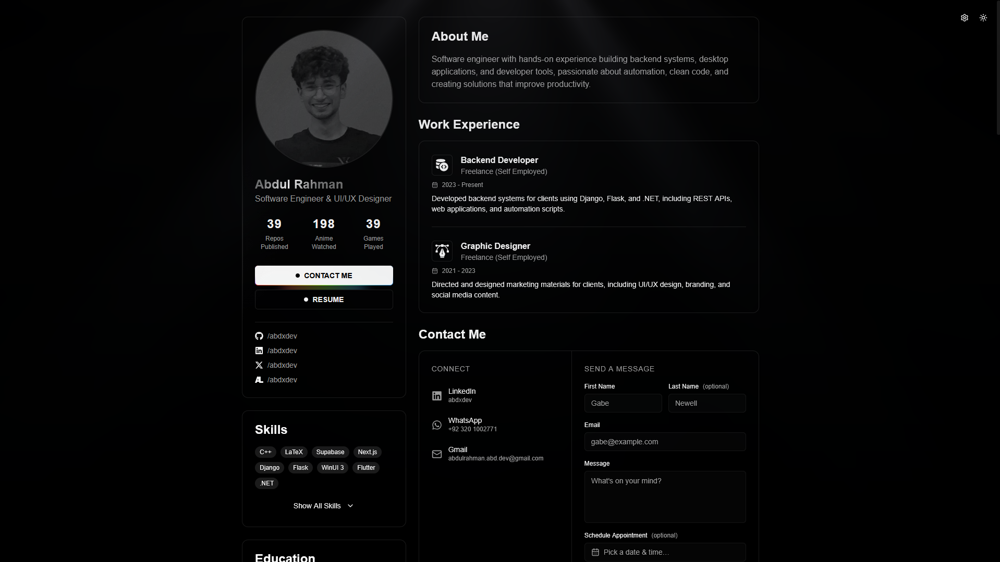

# Portfolio

Minimal personal portfolio built with Next.js.



## Languages & stack

- TypeScript + React + Next.js (App Router)
- Tailwind CSS
- SQL (Supabase/Postgres)
- Markdown (generated profile README)

## Main features

- Responsive portfolio UI (projects, skills, socials, resume)
- API-driven data for portfolio sections
- Contact form with email delivery (and appointment invite support)
- Anonymous conversation inbox with admin replies
- Push notifications for conversation replies (OneSignal)
- Dynamic GitHub project parsing from repo descriptions

## README automation

- `/update-readme` triggers `/api/update-readme`
- `/api/update-readme` sends a GitHub `repository_dispatch` event
- `/api/readme` generates markdown from live portfolio data
- GitHub workflow updates the profile README from this generated output

## Run

```bash
pnpm install
pnpm dev
```
