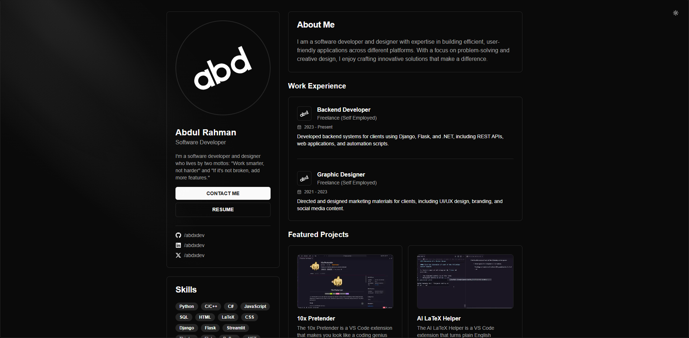

# Developer Portfolio Website

A modern, responsive portfolio website built with Next.js, Tailwind CSS, shadcn/ui and radix-ui components. This portfolio showcases a developer's skills, experience, and projects with a clean, professional design and smooth animations.



## Features

- **Responsive Design**: Fully responsive layout that works across all device sizes
- **Dark/Light Mode**: Built-in theme toggler for user preference
- **Smooth Transitions**: Elegant loading animations and transitions throughout the site
- **Dynamic Project Gallery**: Interactive project cards with image carousel and popup view
- **GitHub Integration**: Automatically fetches and displays GitHub repositories
- **Modern UI Components**: Built with shadcn/ui for consistent, accessible design

## Installation

1. Clone the repository:

   ```bash
   git clone https://github.com/abdxdev/portfolio.git
   cd portfolio-website
   ```

2. Install dependencies:

   ```bash
   npm install
   # or
   yarn install
   # or
   pnpm install
   ```

3. Install required shadcn/ui components:

   ```bash
   npx shadcn-ui@latest add dialog
   npx shadcn-ui@latest add skeleton
   npx shadcn-ui@latest add scroll-area
   npx shadcn-ui@latest add carousel
   ```

4. Run the development server:

   ```bash
   npm run dev
   # or
   yarn dev
   # or
   pnpm dev
   ```

5. Open [http://localhost:3000](http://localhost:3000) with your browser to see the result.

## License

MIT License

## Credits

- UI Components: [shadcn/ui](https://ui.shadcn.com/)
- Icons: [Lucide React](https://lucide.dev/)
- Carousel: [Embla Carousel](https://www.embla-carousel.com/)

## Acknowledgements

Original design inspiration from [GitHub Profile](https://github.com/achris-alonzo30)
